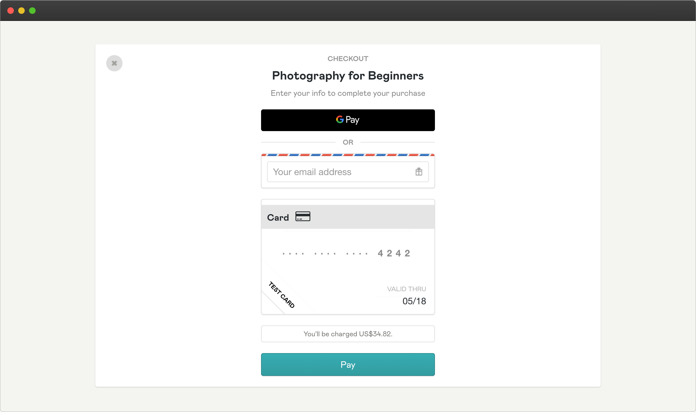

> **Note: this guide is currently out of date and some of the info may be wrong. Will be updated soon.**
 
# CourseKit Getting Started Guide

> For feedback and comments see [this discussion thread](https://github.com/course-kit/guides/discussions/3).

CourseKit is a headless video course hosting platform that will allow you to easily create an online course site with completely custom UI and UX. 

Some of the features of CourseKit include:

- Headless platform with API
- Secure content
- Integration with any JS framework
- JavaScript-based widgets for video player, course controls, etc.

In this guide, we're going to see how it works and get an overview of the key features.

## CourseKit Dashboard

To get started, create a new account with CourseKit. Once your account is created, you'll be able to log in to the cloud-based dashboard.

In the dashboard, you'll first see the **courses page**. For a new account, this will be empty as you haven't created any courses yet.

## Creating a course

To create a course, click the "add" button in the top right of the course pane.


A course has a *name* and an optional *home page URL*. We'll provide a name now, and add a home page URL later.


After creating a course you'll be taken to the **course details page** where you can see the fields you added as well as automatically generated fields that you'll need later (specifically the *ID* and *enrollment URL*) 

## Creating a lesson

A course contains *lessons*. A new course won't have any, though, so you'll need to create some by clicking the "add" button on the lessons pane.


A lesson requires both a *name* and a *video*. The video will be a video file you've created for your course and saved on your computer.

Select a video file, click "Save and upload". Once the video successfully uploads, the lesson will be created.


After creating a lesson, you'll be directed to the **lesson detail page** where you can see the lesson *name*, *ID*, and *video*.


## Creating a course site

Since CourseKit is a *headless* platform, you'll need to create and deploy a course site to provide the view layer of your course.

In this example, we're going to create a course site with [Nuxt 2](https://nuxtjs.org/) which is a [Vue](https://vuejs.org/)-based web app framework capable of generating static sites based on markdown content. You won't need to know Nuxt or Vue to follow this guide. 

> You can view a partially-functioning demo of the finished product [here](https://coursekit-nuxt-demo.netlify.app/).

> You can view the source code of the finished product [here](https://github.com/course-kit/nuxt-demo).

### Architecture

The site architecture is as follows:

- A [home page](https://coursekit-nuxt-demo.netlify.app/), which shows a summary of all of the available courses.
- A dynamic [course page](https://coursekit-nuxt-demo.netlify.app/courses/1), which shows details of a course.
- A dynamic [lesson page](https://coursekit-nuxt-demo.netlify.app/courses/1/lessons/1), which shows content of a lesson (including video).

### Markdown content

Nuxt's [Content module](https://content.nuxtjs.org/) allows you to compose your site's content with markdown files including frontmatter.

The two main entities in CourseKit are *courses* and *lessons*. We're going to create individual markdown files for each.

We'll have this directory structure for the content:

```
content
  courses
    photography-for-beginners.md
    ...
  lessons
    welcome-to-the-course.md
    ...
```

## Home page

Let's firstly create the home page which shows a summary of each available course. The content of this page is mostly static, though we can enhance it with user data from the CourseKit User API (we'll investigate the API later in the guide).


As mentioned, every course will be represented with a separate markdown file with frontmatter. Here is an example:

*content/courses/photography-for-beginners.md*

```markdown
---
id: fc5b9623-e9ed-4adb-8011-55d6fb2fe4f5
title: 'Photography for Beginners'
description: 'Lorem ipsum dolor sit amet, consectetur adipiscing elit. Aliquam suscipit bibendum ex nec interdum.'
thumb: /cole-marshall-xmqG9NCq2DU-unsplash.jpg
productUrl: https://anthonygore.gumroad.com/l/ebvBn
order: 1
---
Lorem ipsum dolor sit amet, consectetur adipiscing elit. Aliquam suscipit bibendum ex nec interdum. Phasellus erat erat, hendrerit quis pretium eu, aliquet nec orci.
```

The content of this file will be used for static rendering of the course pages but is also available in JavaScript at run time. Here's a quick explanation of the properties:

- `id` is the course ID taken from the course we created. You can copy this from the dashboard. This will be used at runtime for calls to CourseKit APIs as well as in URL paths within the site.
- `title`, `description` self-explanatory.
- `thumb` image thumbnail path.
- `productUrl` is a link to the product page on your ecommerce platform.
- `order` is used for sorting the courses when displaying a list (an alternative would be to use created date).

You may be wondering - why do we hardcode all this data in markdown? So long as we have the course ID, couldn't we just retrieve this data from the CourseKit API?

The CourseKit API should only be used for *dynamic* or *private* data. Any public, static data should be hardcoded in the course site so that it can be statically rendered, ensuring a better UX.

## Course page

The course page shows the details of a specific course. To allow for dynamic content, the page will have a dynamic segment `courseId` in the route e.g. */courses/fc5b9623-e9ed-4adb-8011-55d6fb2fe4f5*

To populate the content on this page, we use JavaScript to grab the `courseId` from the URL and match that with a markdown file (remember - each course markdown file has an `id` property).

You can see at the top of the page that we're utilizing the course's `title` for the title and `productURL` for the "Enroll now" button.


### Lesson summaries

We also see summaries of the lessons included in this course. To generate these, we'll now need the lessons markdown files. 

Here's an example of one:

*content/lessons/welcome-to-the-course.md*

```markdown
---
id: 4f994dee-ffa7-476a-94df-e7279f36774e
course: fc5b9623-e9ed-4adb-8011-55d6fb2fe4f5
title: Welcome to the course
description: 'Lorem ipsum dolor sit amet, consectetur adipiscing elit. Aliquam suscipit bibendum ex nec interdum.'
thumb: /leonard-cotte-c1Jp-fo53U8-unsplash.jpg
order: 1
---
Lorem ipsum dolor sit amet, consectetur adipiscing elit. Aliquam suscipit bibendum ex nec interdum. Phasellus erat erat, hendrerit quis pretium eu, aliquet nec orci.
```

The important frontmatter properties to mention are the `id`, which is the lesson ID from the CourseKit dashboard, as well as `course` which is the ID of the course that this lesson belongs to.

To generate the lesson summaries on the course page we use JavaScript to find any lesson belonging to this course and then grab the necessary content properties e.g. `title`, `thumbnail`, `description`, etc.

Again, we will soon see how to enhance the course page with metadata from the User API (for example marking which lessons have already been completed, show the user's progress through the course, etc).

## Lesson page

Perhaps the most important page is the **lesson page** which shows the secure video content. 

The lesson page has a dynamic path */courses/:courseId/lessons/:lessonId.* Note that it has two dynamic segments; one for the *course ID* and one for the *lesson ID*.

Because this content is secure, most of the lesson page content must be created at runtime based on the user's auth status.

For example, if the user is logged in and enrolled, we show the video player. If not, we show an enrollment and login link.


The screenshot above shows the lesson page as it would look when a user is **unauthenticated** i.e. a guest role. 

How do we get the user's role? To understand this we'll now need to look at the **CourseKit API**.

## CourseKit API

The CourseKit API makes your course data and user data available via HTTP. It is secured by OAuth 2.

While you can directly interact with the API, it's far easier to use the [CourseKit client library](https://github.com/course-kit/client) which is a very small and simple-to-use JavaScript package that can be installed from NPM.

There are two main classes provided in this library: `VideoLoader` and `UserLoader`. In this section, we'll cover the `VideoLoader` as that's what's required for the lesson page.

## Video Loader

`VideoLoader` has two primary functions: to load the video URL from the CourseKit API and to mount a video player to the page.

We'll talk about the video URL in a moment. To mount the video player, we'll need to include a DOM element somewhere in the lessons page where the video player will be dynamically inserted. For example:

```html
<!--An empty div used as a mounting element for the video player-->
<div id="video"></div>
```

### Instantiating video loader

To retrieve the video URL from the API, we'll need both the course ID and lesson ID (which can be extracted from the page URL at runtime). 

We pass these values to the `VideoLoader` constructor which will create a new instance. This should happen as soon as the page is ready. In the case of Nuxt/Vue we'd utilize a components `created` hook (though I haven't shown that here for simplicity).

We then use the asynchronous `createPlayer` method and pass it a DOM query string so it can find the page element where the video player is to be inserted. Typically, this will be a div with ID *video*.

```js
import { VideoLoader } from '@coursekit/client'

// This code should be run as soon as the page is ready
const loader = new VideoLoader(courseId, lessonId)
const { status, loginUrl, player } = await loader.createPlayer('#video')
```

The `createPlayer` method returns a promise which resolves to an object with three values:

- `status` the HTTP status of the API call to retrieve the video URL.
- `loginUrl` will be null if the user is logged in, or a URL string otherwise.
- `player` a reference to the video player. This can be used to control the video player, capture player events, etc.

`status` will be one of four values:

- `200` if the user is authenticated.
- `401` if the user is unauthenticated.
- `403` if the user is authenticated, but does not have access to the lesson.
- `500` if there is an error e.g. the user is offline

## Video player UI

It's important to make your UI reflect the video status. Using an `if` or `switch` is a good way to do this. For example, you could show a login link if the status is `401` or `403`.

```js
import { VideoLoader } from '@coursekit/client'

const loader = new VideoLoader(courseId, lessonId)
const { status, loginUrl, player } = await loader.createPlayer('#video')
	
if (status === 200) {
  // User authenticated
  player.addEventListener('ready', () => {
    // Video is ready to play
  })
}

if (status === 401) {
  // User is unauthenticated, show login URL and enrollment link
}

if (status === 403) {
  // User is unenrolled, show enrollment link
}

if (status === 500) {
  // Error
}
```

We haven't seen how to enroll a student yet, so we'll probably get a `401` status back from the API when the lesson page loads, indicating that the user is unauthenticated.

Let's display two buttons in the UI: one to enroll (for new students) and one to log in (for current students).

A good UI design idea is to overlay these buttons on the lesson video thumbnail. You could instead put these in a popup window or whatever else you like.


### Enroll and login links 

How do we create these two links?

The `href` of the "Enroll" link is the `productUrl` (a static value) from the course frontmatter. This should be a link to buy your course from your chosen ecommerce platform (discussed below).

The `href` of the "Log in" link is a *dynamic* value returned from the CourseKit API. The reason it's dynamic is that the CourseKit API is secured by OAuth and therefore requires a fresh security token in the login URL. This requires it to be re-generated on every page load.

The login URL is returned in the payload from the `createPlayer` method which, as discussed previously, should be called when the page loads.

```jsx
const { status, loginUrl, player } = await loader.createPlayer('#video')
```

Using Nuxt/Vue we can bind these values to the page dynamically:

```html
<template>
  <div class="overlay-buttons">	
    <a :href="productUrl">Enroll</a>
    <a :href="loginUrl">Log in</a>
  </div>
</template>
```

We've now seen how the lesson page should look when the user is *unauthenticated*. Before we see how it looks when the user is authenticated, let's see how **enrollment** works.

## Enrollment flow

For a student to be able to see your course's content you'll need to enroll them. This involves multiple steps which we'll cover below. But first, a high-level overview:

1. Student purchases course
2. Webhook from ecommerce platform informs CourseKit of new student
3. Student receives activation email from CourseKit
4. Student clicks activation link and can now login or create an account

## Ecommerce platform

In this example, we'll be using [Gumroad](https://gumroad.com/) as the ecommerce platform, but you can use any platform you like so long as it can trigger a webhook.

Below, you can see a screenshot of a Gumroad product set up for this example course. You can, of course, set this up however you like with any price, content, etc.


### Product URL

Once you've created a Gumroad product, you'll be given a link to the product page. This URL is then placed in the course frontmatter from where it can be retrieved and shown across your site.

```markdown
---
...
productUrl: https://anthonygore.gumroad.com/l/ebvBn
---
```

### Redirect URL

Go ahead and set the Redirect URL of your product back to your course landing page e.g. *https://coursekit-nuxt-demo.netlify.app/courses/1*. 

> You can use [ngrok](https://ngrok.com/) here to test when developing on localhost.
> 


### Enrollment URL

Once a student has purchased a course on your ecommerce platform, how do they get enrolled on CourseKit?

You'll recall from the beginning of the guide that each course you create is automatically assigned an **enrollment URL**. This URL is an endpoint where you can POST data of students you wish to enroll in that course. Both *name* and *email* are required fields.

Here's an example of how you'd enroll a student using Curl:

```bash
curl -X POST https://api.coursekit.dev/enroll/f89d0sk0k2
   -H "Content-Type: application/json"
   -d '{"email": "kilgore@trout.com", "name": "Kilgore Trout"}'
```

> Note: this URL should be kept secret as it could be used by anyone to add students to your course! Don't include it in any source code.
> 

### Enrollment webhook

The intention of the enrollment URL is that it will be used by a webhook on your ecommerce platform.

For example, Gumroad provides a webhook service called Ping that will post a customer's data to a URL after a purchase is made. You can simply include the enrollment URL generated by CourseKit here and it will work.


To test this, go to either the course page or lesson page and click the "Enroll" button. You'll then be taken to the product purchase page on Gumroad where you can make a test purchase.



Once the purchase completes, return to the CourseKit dashboard and go to the **students page** in the side menu, and you'll see your test user details.

Note that the status of this student is "Pending". To get to the "Active" status, the student must *activate* their course.


## Course activation

Now that the Gumroad product and webhook are set up we need to direct students to activate their new course. 

In the activation process, the student will either log in to CourseKit or create a new account. This is necessary to ensure your students have secure access to the courses they've purchased.

Let's go one step back to when a student purchases your course. After the payment is processed successfully, Gumroad will redirect them back to your course page. It's a good idea to show a message here so that students are informed that they won't be able to access the course until they activate their account.

> Note: Gumroad will automatically append a query parameter `sale` to the redirect URL. You can use JavaScript to check for this parameter and conditionally show the message.


In the meantime, Gumroad will call the webhook which informs CourseKit of a new student. CourseKit will use the provided email address to send the activation email to the student. 

The activation email includes a unique link.


When the unique link in the email is clicked, the student is sent to the CourseKit login and registration page.


## Activation redirect

Once the student has created their account, they will need to be redirected somewhere. This should probably be your course landing page so they're able to get started on your course immediately afterward.

By default, CourseKit will redirect them to a generic "Thanks for registering" page. It's better, though, if you provide a *home page URL* value for your course.

To do this, you'll need to edit your course in the dashboard and provide your course's home page URL, for example, https://coursekit-nuxt-demo.netlify.app/courses/1. Again, if you're developing locally, you can use an ngrok URL.


Now that that is set up, new students will be redirected to your course landing page after they create an account.

Again, you should display a message to let them know their activation was successful. CourseKit will add a `registered` query parameter to your course home page URL which you can detect with JavaScript and use to conditionally show a message.


If you check the CourseKit dashboard again, you'll see your student's status has now changed from "Pending" to "Active".


## Authenticated student features

Let's return now to the lesson page which we were looking at before the discussion of enrollment.

When a student logs in or registers with CourseKit they will now be authenticated with the CourseKit API.

This means that calls to the `createPlayer` method of the VideoLoader API will return a 200 status (assuming the student is looking at lessons from a course they've purchased).

It also means the video will be loaded and the `player` API will be available for use.

```js
import { VideoLoader } from '@coursekit/client'

const videoLoader = new VideoLoader(courseId, lessonId, {})
const { status, loginUrl, player } = await videoLoader.createPlayer('#video')
	
if (status === 200) {
  // User authenticated
  player.addEventListener('ready', () => {
    // Video is ready to play
  })
}
```

The student can now control the video by interacting with the player.

Being authenticated with the CourseKit API provides several other features in addition to secure videos. For example, you'll see a "Complete and continue" button below the video which allows a user to mark a lesson complete.


This and many other features are available through the **User API** and will be the subject of the last part of this guide.

## User API

The `UserLoader` class of the CourseKit client library provides access to the User API. This API provides metadata that can be utilized to improve the UX of the site, especially for authenticated students.

Some of the possible features include:

- Marking a lesson complete
- Seeing complete and incomplete lessons
- Redirecting to the next incomplete lesson when a lesson is completed
- Seeing enrolled and unenrolled courses

Let's first look at the API methods, then we'll see how these are utilized in the UI to provide these features to your course.

### Creating user instance

Once we've imported the `UserLoader` class we can create a new userLoader instance. We can then use the `createUser` method which will return a promise that resolves to an object that contains the `status`, `loginUrl`, and `user` object.

The `status` and `loginUrl` are exactly the same as with the Video API so I won't repeat their explanation. The `user` object methods will be covered below.

```js
import { UserLoader } from '@coursekit/client'
const userLoader = new UserLoader()
const { status, loginUrl, user } = await userLoader.createUser()

if (status === 200) {
	console.log(user.getName()) // "Kilgore Trout"
}

if (status === 401) {
	console.log(user.getName()) // null
}

```

## Lesson page features

Part of a good online course UX is to allow students to mark lessons as complete so they can track their progress and know what to look at next time they visit the course.

Lesson completion is a part of a user's metadata. The CourseKit API provides the following methods to control this.

- `user.markComplete(courseId, lessonId)` marks a lesson complete
- `user.markIncomplete(courseId, lessonId)` marks a lesson incomplete

### Complete and continue feature

As we saw before, the lesson page can include a "Complete and continue" button. This will provide a way to use the `markComplete` method from the UI as well as redirect the user to the next incomplete lesson.


To implement this, we can create an async function `markCompleteAndNext` which uses `markComplete` as well as `getNextLessonId` which returns the next incomplete lesson from the specified course.

This method can be called either when the user clicks the "Complete and continue" button, or it can be called programmatically when the user gets to the end of the video by listening to the `ended` event from the player.

```js
const markCompleteAndNext = async () => {
  await user.markComplete(courseId, lessonId)
  const nextLessonId = user.getNextLessonId(courseId)
  router.push(`/courses/${courseId}/lessons/${nextLessonId}`
}

// Complete and continue button
button.addEventListener('click', markCompleteAndNext)

// Or, automatically when video ends
player.addEventListener('ended', markCompleteAndNext)
```

## Course page features

Based on lesson completion metadata, the User API provides helper methods that will provide common course page features including:

- `user.isLessonComplete(courseId, lessonId)` returns boolean based on completion status of lesson.
- `user.getNextLessonId(courseId)` returns the next incomplete lesson ID from the specified course
- `user.getProgress(courseId)` returns the progress ratio. e.g. `0.5` if they've completed 10 out of 20 lessons.

These methods will provide the data you'll require for a "resume" button, a course progress meter, and provide a "Watched" flag on your lesson list.


### Resume button

On your course page, you'll probably want a "resume" button which will take the user to the next lesson from where they previously stopped. Use the `getNextLessonId` method for this.

```js
const nextLessonId = user.getNextLessonId(courseId)
router.push(`/courses/${courseId}/lessons/${nextLessonId}`
```

### Progress meter

On the course page, you can also include a course progress meter UI feature so a user can see how much of the course they've already completed.

Use the `getProgress` method and either show this as a value, or use to it to power a visual indicator.

```js
const progressPerc = user.getProgress(courseId)
console.log(progressPerc) // 0.23
```

### Completed flag

If the course landing page has a list of lessons, it's a good idea to show which ones have already been completed. An easy way to do this is to map your courses lessons and add a boolean flag `complete`.

```js
const lessonsWithStatus = lessons.map(lesson => {
  lesson.complete = user.isLessonComplete(courseId, lesson.id)
  return lesson
})
```

## Home page features

Let's now return to the site's home page where we display a list of courses. You can utilize the User API to flag which courses the user has enrolled in.


Similar to the completed lessons flag, we can map our courses and include an `enrolled` flag.

```js
const coursesWithStatus = courses.map(course => {
  course.enrolled = user.isCourseEnrolled(course.id)
  return course
})
```

## Account management

The final feature we'll look at in this guide is account management. To make things easier, CourseKit provides a student account management page where students can change their password, update their email address, etc.

If you look at any of the previous screenshots, you'll see that when the user is unauthenticated, we provide a "Log in" button in the nav bar, and when they're authenticated we change it to a "My Account" button.

These buttons require a URL from the API since, as mentioned, the URLs need fresh OAuth tokens to be valid.

Here's an example of how this can be achieved using JavaScript and the User API.

```js
import { UserLoader } from '@coursekit/client'
const userLoader = new UserLoader()
const { status, loginUrl, user } = await userLoader.createUser()

const btn = document.querySelector('.navbar a.user-btn')
if (status === 200 || status === 403) {
  btn.setAttribute('href', user.getAccountUrl())
  btn.innerHTML = 'Manage account'
} else {
  btn.setAttribute('href', loginUrl)
  btn.innerHTML = 'Log in'
}
```

## Wrap up

In this guide, we've covered the key features of the CourseKit platform including the dashboard and API. We've seen how to utilize these features to create a secure course in a Nuxt static site.
