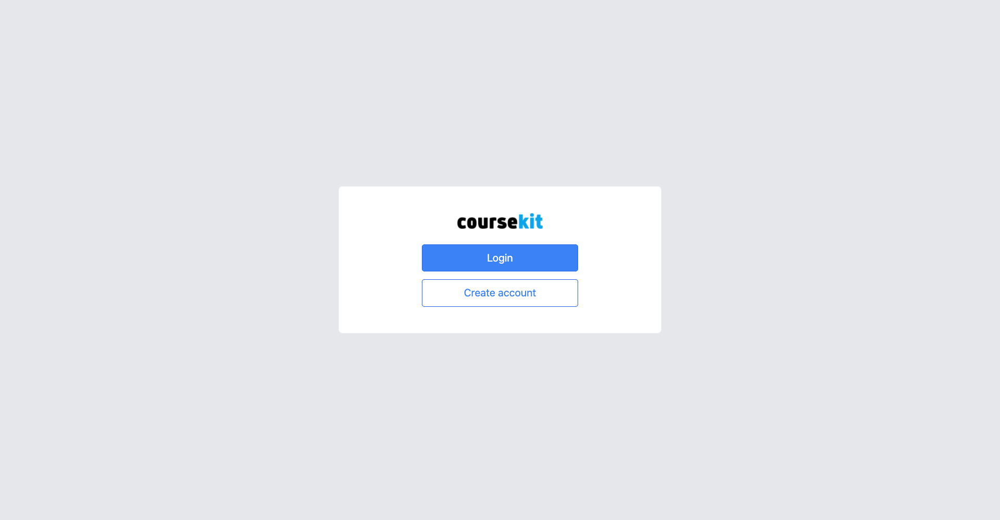
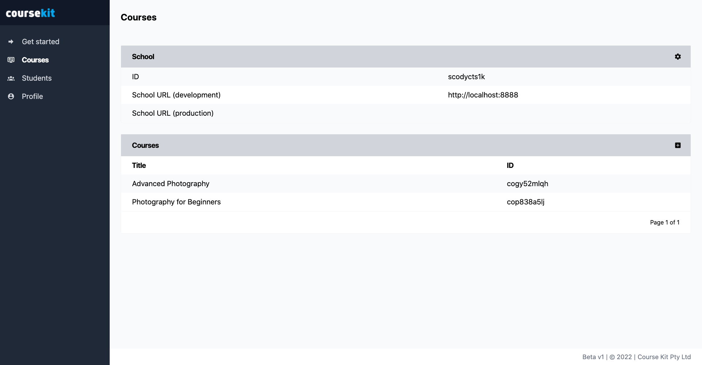
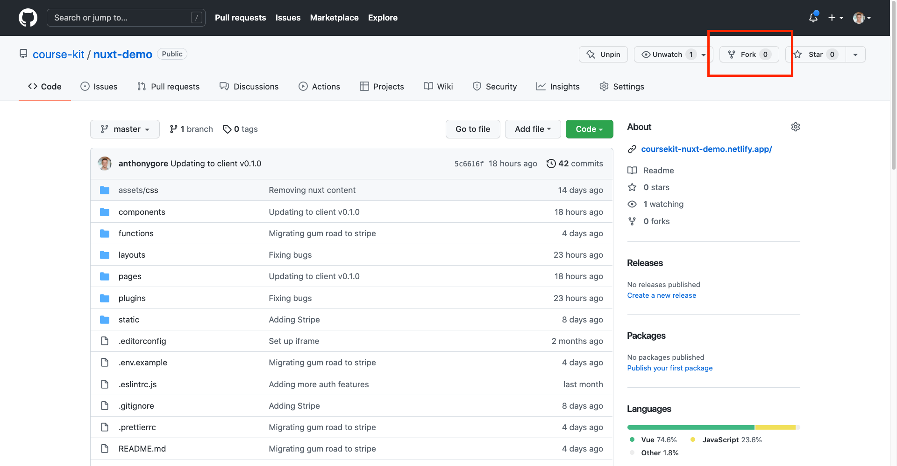
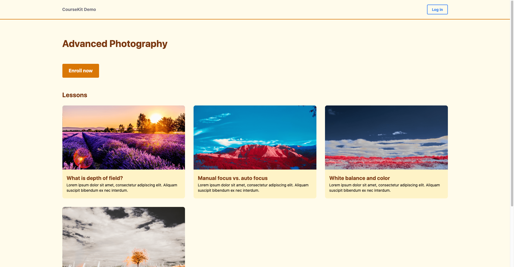
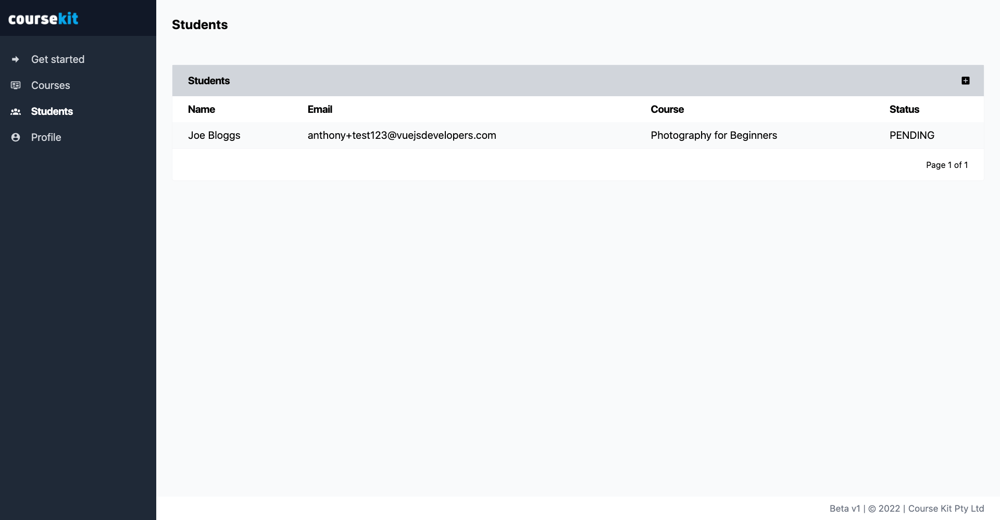
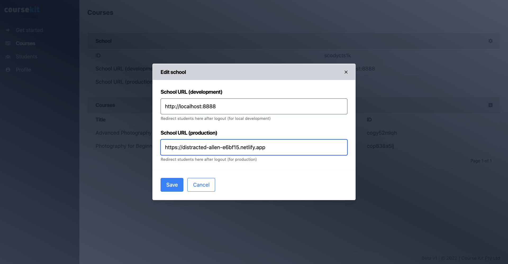

# CourseKit Quick-Start Guide
## Part 1: Set up and deploy course site

CourseKit is the easiest way for developers to create fully-custom online courses using their favorite frontend tech stack. Thanks to the CourseKit headless API platform, you won’t need a server, just a static site and you’ll get all the features you’ll need to provide a rich course experience for your prospective students.

This guide will take you through the steps of setting up a working CourseKit site in around ten minutes! After that, you can go back and customize it how you want and fill in the content for your lessons so you’re ready to launch.

The guide is in three sequential parts:

1. **Part 1: Set up and deploy course site (this document)**
    1. **Create a CourseKit account**
    2. **Clone one of the site templates on GitHub**
    3. **Link your site to your account**
    4. **Deploy to Netlify**
2. [Part 2: Enable paid students with Stripe enrollment](./quick-start-part-2.md)
3. [Part 3: Add lesson content including Vimeo videos](./quick-start-part-3.md)

> **Note: if you need any help or have any questions be sure to join the [CourseKit Discord](https://discord.gg/ugXJFkw6hv).**

## What you’ll build in part 1

By the end of the first part of the guide, you'll have cloned a CourseKit static site template and deployed it to Netlify. This static site will display courses and lessons that can be edited from the dashboard. You'll be able to manually add students who can log in and take your course.

Here's what your site home page will look like:


## Requirements

To use this guide you’ll need the following:

- GitHub account
- [Netlify account](https://netlify.com)
- Node & NPM installed
- [Netlify CLI](https://docs.netlify.com/cli/get-started/) installed

## Create a CourseKit account

The first thing we'll do is create a CourseKit school. Go to [https://dashboard.coursekit.dev](https://dashboard.coursekit.dev) and register for an account.



After your account is created you’ll be taken to the CourseKit dashboard. If you click on the “Courses” tab you’ll be able to see your basic school information and your courses. 

> Note: there are already two test courses added by default to a new user’s account - *Photography for Beginners* and *Advanced Photography*. These courses provide dummy data you can play with and help you understand how courses set up in CourseKit. After you complete this quickstart you can, of course, customize these with your own content, or delete them altogether.



Click the Photography for Beginners course and you’ll see it has four lessons attached.


You may have questions about what some of the other fields are for. We'll utilize all of these fields later in the guide!

## Install site template

Now that you have an account with some test courses and lessons created, you'll want to create a course website where you courses will be displayed.

Rather than doing that from scratch, let's install this [site template](https://github.com/course-kit/nuxt-demo). This will allow us to get the basic features of a course set up now and come back later and customize the UI and UX to your taste.

> Note: as CourseKit is still new, we currently only have the [Nuxt (Vue.js)](https://github.com/course-kit/nuxt-demo) template available (more will be providing using other JavaScript frameworks). Even if you don't want to use Nuxt or Vue to create your course, I recommend you continue following this guide to get a feel for CourseKit and then build your own site later.

To install the template, first, make a fork by clicking the "Fork" button in the top right. It's important to do this so that you have your own private repo that you can deploy from.



Once you've forked the template, open a terminal and clone the template on your computer:

```bash
$ git clone https://github.com/<your-github-account>/nuxt-demo.git
```

Now, change into the directory and install NPM modules.

```bash
$ cd nuxt-demo
$ npm i
```

## Add config

After the NPM modules are install, create a `.env` file where you can add environment variables for config.

```
$ touch .env
```

Firstly, set the `NODE_ENV` variable to `development` so that our site uses development features and the CourseKit API realizes we're in test mode. You'll also need to set the `COURSEKIT_SCHOOL_ID` here so CourseKit knows which school to link this site to. 

> You can find your school ID in the dashboard on the "Courses" page.

*.env*

```
NODE_ENV=development
COURSEKIT_SCHOOL_ID=<your school ID>
```

Now save the .env file.

## Run dev server

In this guide, we'll be using Netlify to deploy our course site. You'll need the [Netlify CLI](https://docs.netlify.com/cli/get-started/) installed as we'll be using several CLI features and commands. 

Let's now run a dev server:

```
$ netlify dev
```

After the dev server finishes compiling, Netlify CLI will open your site in the browser. 

> Note: you will need to use the default port of 8888 otherwise the redirect URLs in the dashboard will be wrong (redirect URLs will be explained later in the guide).


Now, take a look around your site. You should see your two courses being rendered, as well as all the lessons. Here’s what the main course page looks like:



To see the lesson content, you’ll need to login as a student. If you click the login button in the navigation bar, you’ll be taken to the login screen:


You can only login to the site as a student. How can we add a student account?

## Adding test student

To enroll a student in your course, you can get them to pay for your course via an ecommerce tools like Stripe or Gumroad. After they’ve paid, you can use a webhook to add them to CourseKit with the API. We’ll be setting this up in part 2 of the quickstart.

For now, we can simply add students to your course manually via the dashboard.

Go to Students tab of the dashboard and click the add (plus) button where you can enter a name and email, and select a course.

> Note 1: you’ll need to use an email address that you can access, since, as we’ll see, students require email activation. However, the email should be different to your CourseKit user email. If you don’t have extra email addresses, an easy way is to put a “+” e.g. yourname+something@domain.com. This email should automatically be aliased to your current inbox.
> 

> Note 2: Tick the box the says “Redirect to homepage URL”
> 


After you’ve added a student, you’ll see them added to your student list with status “Pending”. This means they’ve been sent an activation email and will now need to create an account.



You should now receive the activation email. This email contains a unique URL that allows you to create an account and enroll in the course.


Click the link, and you’ll be asked to register for the course.


Once you’ve created an account, you will be redirected to the course home page (remember, we set this URL in the dashboard so if it’s wrong you’ll need to fix it there).


Returning to the dashboard, refresh the page and you should now see the student has gone from “Pending” to “Active”.


## Logged in features

Now that you’re logged in to your site, click around and you’ll see a variety of features you couldn’t see when you were logged out. For example, clicking on a lesson page you should see the lesson content!


Go ahead and experiement with the site - play the video, complete the lessons, etc. Keep in mind all the content and site behavior can be customized.

## Deploy to Netlify

In the last section of this guide we’ll deploy the site to Netlify so it can be used by prospective students. We’ll first link your forked template to a Netlify site. 

To do this, kill your Netlify dev server (Ctrl + C) then run:

```
$ netlify init
```

Select the following prompts:

```
**? What would you like to do?** Create & configure a new site
**? Team:** <select your team>
**? Site name (optional):** <either choose something or leave blank>
**? Your build command (hugo build/yarn run build/etc):** npm run generate
**? Directory to deploy (blank for current dir):** dist
**? Netlify functions folder:** functions
```

Netlify should now print out your site details including the site URL.

Next, we’ll set our environment variables. For now, we’ll only need one for the school ID.

```
$ netlify env:set COURSEKIT_SCHOOL_ID <your schoolId> 
$ netlify env:set NODE_ENV production
```

You’ll now need to rebuild the site for these environment variables to be incorported in the site build. To do this, 


## Configure production site in dashboard

The final thing we need to do is tell the CourseKit dashboard about the new site.

For a student to be redirected to your course after the login or out, we need to set the URLs in the course dashboard. We didn’t have to do this before in local development because the aut-generated  efore that we set our school homepage and individual course homepages in the dashboard? We set those to *local* values so we could test locally. Let’s now set the deploy values as well - so we’ll set the school URL, and a home URL for each course

```
// School URL
<your netlify url>

// Each course URL
<your netlify url>/courses/<course id>
```




With that done, students will now be able to log in and out of your production course.

## Wrap up

With that done, you now have a deployed course site! My recommendation is that you now spend some time exploring the dashboard and template code to better understand the 

In part 2 of the quickstart, we’ll set up Stripe products so that users can now enroll by purchasing the course.
