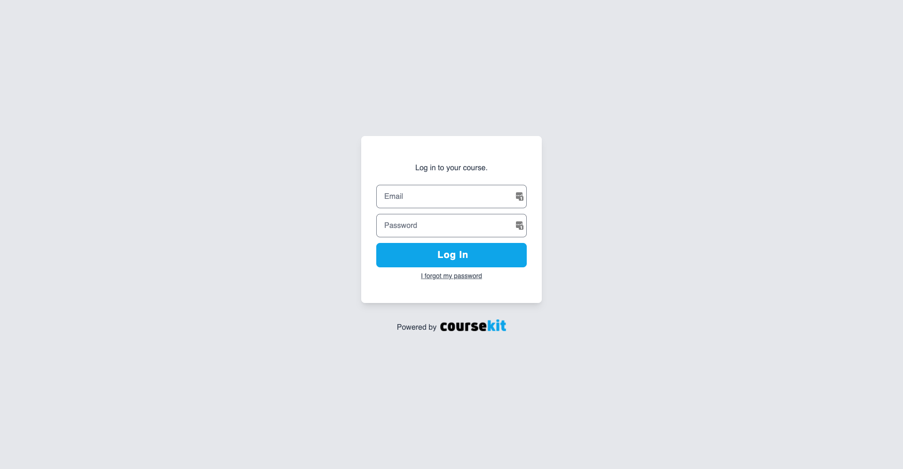
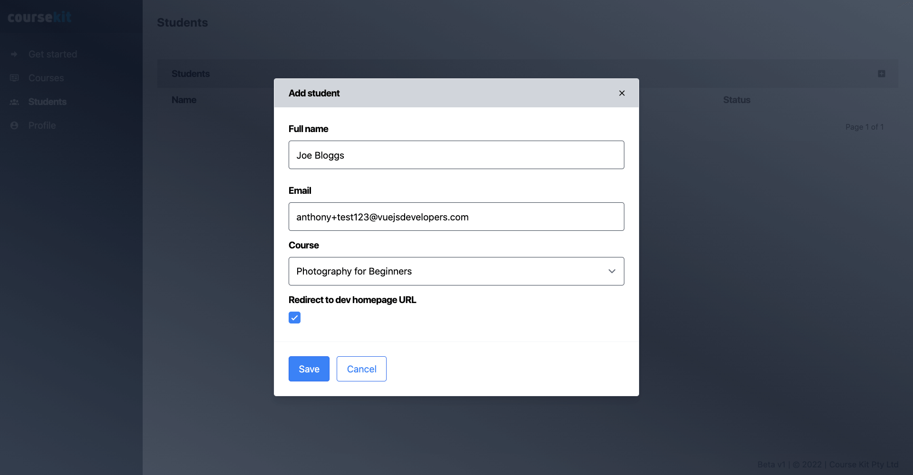
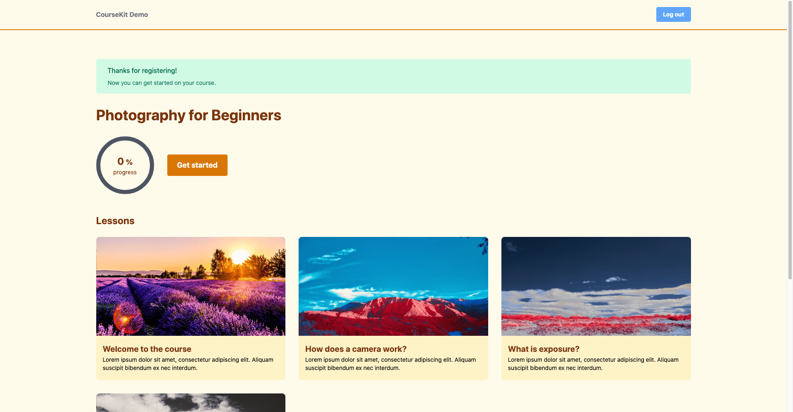
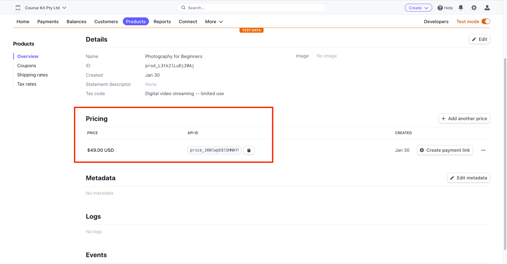
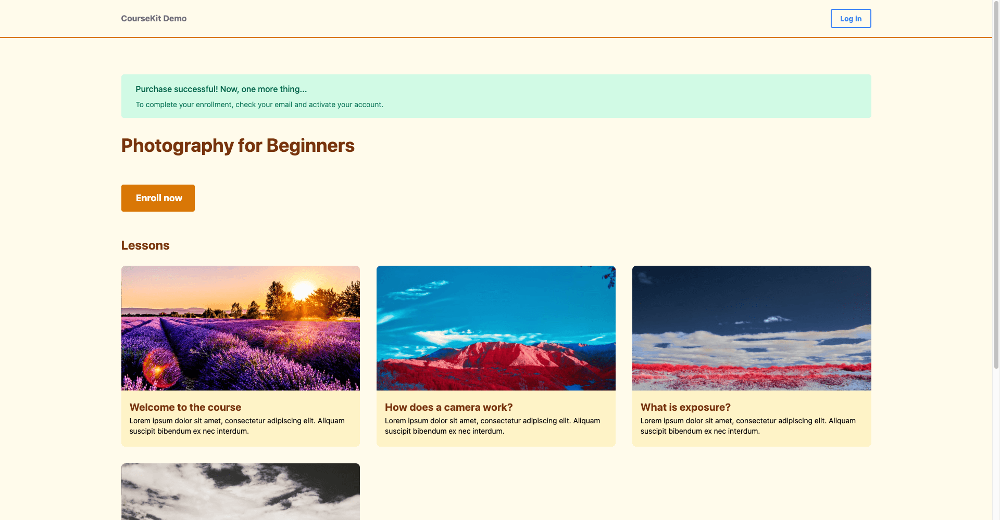

# CourseKit Quick-Start Guide

> For feedback and comments see [this discussion thread](https://github.com/course-kit/guides/discussions/5)

CourseKit is the easiest way for developers to create fully-custom online courses using their favorite frontend tech stack. Thanks to the CourseKit headless API platform, you won’t need a server, just a static site and you’ll get all the features you’ll need to provide a rich course experience for your prospective students.

**This guide will take you through the steps of setting up a working CourseKit site in around fifteen minutes! After that, you can go back and customize it how you want and fill in the content for your lessons so you’re ready to launch.**

Here's a summary of the main steps:

1. Create a CourseKit account
2. Clone one of the site templates on GitHub
3. Link your site to your account
4. Deploy to Netlify
5. Set up Stripe products
6. Set up Stripe webhook
7. Link Stripe products to site

> **Note: if you need any help or have any questions be sure to join the [CourseKit Discord](https://discord.gg/ugXJFkw6hv).**

## What you’ll build

By the end of the guide, you'll have cloned a CourseKit static site template and deployed it to Netlify. This static site will display courses and lessons that can be edited from the dashboard. Students will be able to enroll by purchasing a Stripe product after which they can log in and take your course.

Here's what your site home page will look like:


## Requirements

To use this guide you’ll need the following:

- GitHub account
- [Netlify account](https://netlify.com)
- [Stripe account](https://stripe.com)
- Node & NPM installed
- [Netlify CLI](https://docs.netlify.com/cli/get-started/) installed

## Create a CourseKit account

The first thing we'll do is create a CourseKit school. Go to [https://dashboard.coursekit.dev](https://dashboard.coursekit.dev) and register for an account.


After your account is created you'll be taken to the CourseKit dashboard. If you click on the “Courses” tab you’ll be able to see your basic school information and your courses. 

> Note: there are already two test courses added by default to a new user’s account - *Photography for Beginners* and *Advanced Photography*. These courses provide dummy data you can play with and help you understand how courses are set up in CourseKit. After you complete this quickstart you can, of course, customize these with your own content, or delete them altogether.


Click the *Photography for Beginners* course and you’ll see it has four lessons attached.


You may have questions about what some of the other fields are for. We'll utilize all of these fields later in the guide!

## Install site template

Since CourseKit is a "headless" course platform, your course content is accessible through an API. So now you'll want to create a course website where your courses can be displayed.

Rather than creating a site from scratch, let's install a [site template](https://github.com/course-kit/nuxt-demo). This will provide the basic features of a course out-of-the-box, and allow you to come back later and customize the UI and UX to your taste.

> Note: as CourseKit is still new, we currently only have the [Nuxt (Vue.js)](https://github.com/course-kit/nuxt-demo) template available (more will be provided soon). Even if you don't want to use Nuxt or Vue to create your course, I recommend you continue following this guide to get a feel for CourseKit and then build your own site later.

To install the template, first, make a fork by clicking the "Fork" button in the top right. It's important to do this so that you have your own private repo that you can deploy from.


Once you've forked the template, open a terminal and clone the template on your computer:

```bash
$ git clone https://github.com/<your-github-account>/nuxt-demo.git
```

Now, change into the directory and install NPM modules.

```bash
$ cd nuxt-demo
$ npm i
```

## Add config

After the NPM modules are installed, create a `.env` file where you can add environment variables for config.

```
$ touch .env
```

Firstly, set the `NODE_ENV` variable to `development` so that your site uses development features and the CourseKit API realizes you're in test mode. You'll also need to set the `COURSEKIT_SCHOOL_ID` here so CourseKit knows which school to link this site to. 

> Note: You can find your school ID in the dashboard on the "Courses" page.

*.env*

```
NODE_ENV=development
COURSEKIT_SCHOOL_ID=<your school ID>
```

Now save the .env file.

## Run dev server

In this guide, we'll be using Netlify to deploy our course site. You'll need the [Netlify CLI](https://docs.netlify.com/cli/get-started/) installed as we'll be using several CLI features and commands. 

Run this command from the project root:

```
$ netlify dev
```

After the dev server finishes compiling, Netlify CLI will open your site in the browser. If you've configured it correctly, the home page will display your two courses.

> Note: make sure you use the default port of 8888 for the Netlify dev server otherwise the redirect URLs in the dashboard will be wrong (this will be explained later in the guide).


Now, take a look around your site. Click your courses and see the main course page, as well as all the lessons.


You'll notice that the lesson content cannot be viewed without logging in as a student. If you click the **login** button in the navigation bar (top right), you’ll be taken to the login screen:



We haven't yet added any student accounts, though, so let's do that now.

## Enrolling test students

To enroll a student in one of your courses, you will likely get them to pay for your course via an ecommerce platform like Stripe or Gumroad. We'll be setting up Stripe products shortly. For now, you can add students to your courses manually via the dashboard.

Go to **Students tab** of the dashboard and click the add (plus) button where you can enter a name, email, and select a course. You should also tick the checkbox indicating that the student should be redirected to the development site after login rather than the production site.

> Note: you'll need to use an email address that you can access since students require email activation. However, the email should be different from your CourseKit user email. If you don't have extra email addresses, an easy way is to append `+<some string>` to your email prefix e.g. *yourname+somestring@domain.com*. This email should automatically be aliased to your current inbox.



After you've added a student, you'll see them in your student list with status "PENDING". This means they've been sent an activation email and will now need to create an account.


You should now receive the activation email. This email contains a unique URL that allows the student to create an account and enroll in the course.


Click the link, and you'll be asked to register for the course. This is not the same login as the CourseKit dashboard - this is the login for student accounts - so create a unique account here.


Once you've created a student account you'll be redirected to the course home page.

> Note: if the redirect failed, you either didn't use port 8888 for your site or you didn't check the "Redirect to dev homepage URL" option when you enrolled the student!



Returning to the student tab of the dashboard, refresh the page and you should now see the student status has gone from "PENDING" to "ACTIVE". This means they now have an active enrollment in the specified course.


## Logged in features

Now that you're logged in as a student, click around your site and you'll see a variety of features you couldn't see previously. Most notably, if you click a lesson page you should now be able to see the lesson content!

> Note: all the lessons of the dummy courses have a test Vimeo video and some lorem ipsum text. You can customize this content in the dashboard by changing the vimeo IDs to your own video IDs and by providing your own markdown content.


Go ahead and experiment with the site - play the video, complete the lessons, etc. And keep in mind all the content and site behavior can be customized by modifying the code of your template. If you're interested in how to do this, check out the [CourseKit JavaScript client](https://github.com/course-kit/client).

## Deploy to Netlify

Let's now deploy the site to Netlify so it is publicly available for your students to use. 

We'll first link your forked template to a Netlify site. To do this, go back to the terminal and kill your Netlify dev server (Ctrl + C) then run:

```
$ netlify init
```

Enter the following at each of the prompts:

```
? What would you like to do? Create & configure a new site
? Team: <select your team>
? Site name (optional): <either choose something or leave blank>
? Your build command (hugo build/yarn run build/etc): npm run generate
? Directory to deploy (blank for current dir): dist
? Netlify functions folder: functions
```

Netlify should now print out your site details including the site URL.

Next, we'll need to set the same environment variables from your *.env* file in the Netlify site.
```
$ netlify env:set COURSEKIT_SCHOOL_ID <your schoolId> 
$ netlify env:set NODE_ENV production
```

You'll now need to rebuild the site for these environment variables to be incorporated in the site build. To do this, you'll have to go to the [Netlify web app](https://app.netlify.com) and manually trigger a deploy:


## Configure production site in dashboard

The final thing we need to do is tell the CourseKit dashboard about the production site - specifically, we have to set the **redirect URLs** which tell CourseKit where to send students when they log in or register for your course.

Firstly, we'll set the school URL. To do this, go to the **Courses tab**, and click the edit button in the top right of the School pane.

Leave the School URL (development) value as is, but set the School URL (production) value to the URL of your Netlify site.


Next, set the URL of each course. To do this, go to a course, and copy the course ID from the Course info pane. Then click the edit course button (top right of Course info pane).

Set the homepage URL (production) of your course to:

```
<your netlify url>/courses/<course id>
```


Repeat this for the other course:


> Note: You can have both a development value and a production value for each redirect URL. We didn't have to set the development URL value because that was auto-generated as part of the dummy course data. If you need to use a different dev server port (e.g. 8889 instead of 8888) you'd need to change it here.

## Stripe products

Now that we have a deployed course site, we're going to set up Stripe products for our courses so that users can enroll themselves by making a purchase.

Stripe provides a simple [client-only checkout feature](https://stripe.com/docs/payments/checkout/client) that can be added to your site with a few lines of JavaScript. Since the template you cloned already includes this code, all you need to do is set up the products in your Stripe dashboard and add the API keys to your site code.

> If you haven’t already got a Stripe account, you can [create one for free](https://stripe.com). 

## Paid enrollment flow

Once someone purchases your course, how does CourseKit know they are enrolled? This is where we'll need to utilize Stripe's webhook feature. After a purchase the student's email will be sent to the CourseKit API where a pending enrollment will be created. 

From here, the enrollment process is identical to the manual enrollment process we saw above i.e. the student receives an email from which they can activate their account, etc.

Here is a summary of the paid enrollment workflow:

1. The student clicks the enrollment link on a course and is redirected to Stripe checkout.
2. The students enters their payment details and pays.
3. Stripe triggers a webhook which calls a Netlify function.
4. The function sends the student's data to CourseKit which creates a pending enrollment.
5. The student receives an activation email for the course.
6. The student activates their account by either registering or logging in.

## Stripe API keys

We're going to require API access to Stripe, so we'll begin by retrieving the **Stripe API keys** and adding them to our development site. First, go to your [Stripe dashboard](https://dashboard.stripe.com) and make sure you’re in "Test mode" (see the toggle in the top right) and then go to the "Developers" page.

From there, click the "API keys" tab. You should be able to now see two keys: your publishable key (starts with `pk_test..`) and your secret key (starts with `sk_test...`).


Add both these variables to your *.env* file.

*.env*

```
STRIPE_PUBLISHABLE_KEY=pk_test_...
STRIPE_SECRET_KEY=sk_test_...
```

## Create products in Stripe

The next thing we'll do is create **Stripe Products** for our two courses. To do this, go to the "Products" page in the Stripe dashboard.


Now click "Add product" and we'll add the first course product. For the product title, use the course name e.g. "Photography for Beginners".

Next, go to "Pricing information" and set a price of your choice. Make sure it’s a "One time" purchase as opposed to a subscription. You can, of course, use subscription pricing with CourseKit, but we'll make it a one-time purchase in this example.


Go ahead and create the product after which you'll be taken to the product detail page. Under the "Pricing" heading, you’ll see that you've been given a **price API ID** (start with `price_...`). 





Copy the price API ID, then go back to the .env file and add a new environment variable `COURSE_1_PRICE_ID`:

*.env*

```
COURSE_1_PRICE_ID=price_a73....
```

Repeat the above steps now for the second course, "Advanced Photography". After you're done, you should have the price ID env variable stored for both courses:

```
COURSE_1_PRICE_ID=price_a73....
COURSE_2_PRICE_ID=price_xv4....
```

## Adding price ID to course content

The price API IDs we've added to the environment variables will be used in the enrollment webhook, as we'll see below. However, the frontend site also needs these API keys to link the enroll button on your course to the correct checkout page.

So, let's add these price IDs to our course content in the dashboard. Go to the Courses tab and add a new frontmatter variable to the `public` object which will be `stripePriceId`. 

```
---
public:
  description: 'Phasellus ac tellus tincidunt, pharetra dui eu, bibendum nulla.'
  thumb: /cole-marshall-xmqG9NCq2DU-unsplash.jpg
  stripePriceId: price_a73...
---
Pellentesque aliquet odio arcu, at vestibulum orci molestie vel. Maecenas fringilla nibh et nisl lobortis cursus. Sed aliquam congue lobortis.
```

Save, and repeat for the other course.

## Testing the checkout

Now that we have the Stripe API key and the price keys, we're ready to test the checkout. Go ahead and restart your site's dev server so the new environment variables are recognized.

```
$ netlify dev
```

Now, go to a course page and click "Enroll now". Under the hood, this button is now a link to your Stripe product checkout page.


After a moment you'll be taken to the product's checkout page. Since the product was created in Test mode, you can enter phony details to test a purchase.

Be sure to use an email address that you can access. Use the credit card number "424242424242424242" and make up any other details and submit the purchase.


After the purchase completes, you should be redirected back to the course page. You should also see a "purchase successful" message at the top of the page.



While the checkout process worked, *the student will not yet be added to your course*. To make this happen, we now need to set up a Stripe webhook to call a Netlify function that will in turn add the student to CourseKit.

## Enrollment URL

You may have noticed in the CourseKit dashboard that each course has an *enrollment URL* value. This is a unique URL that, if you HTTP POST an `email` value to it, will create a pending enrollment for the student with that email.


Copy the enrollment URL for each of the two courses and put them in your .env file:

```
COURSE_1_ENROLLMENT_URL=https://api.coursekit.dev/enroll/...
COURSE_2_ENROLLMENT_URL=https://api.coursekit.dev/enroll/...
```

## Purchase callback

If you haven't used them before, **Netlify functions** are Node.js scripts you can add to your site that will be run in a secure context upon being requested.

In the template used to create your site, there will be a function already created: *functions/purchase-callback.js*. When you deployed your site, this function was automatically deployed by Netlify to the URL `<your netlify url>/.netlify/functions/purchase-callback`.

This function is the "purchase callback" and has the job of responding to a Stripe webhook and then calling the correct enrollment URL with the user data which it grabs from POST body.

You don't need to change this function at all, but you will need to now set up the Stripe webhook which will activate this function. 

## Creating a Stripe webhook

To create a **Stripe webhook**, go back to the Stripe dashboard and go to *Developers > Webhooks* and click "Add an endpoint".

While you can test your webhook locally using Stripe CLI, to keep this guide simple we’re going to skip straight to deployment. So for the *Endpoint URL* field, provide your purchase callback's deployed URL which will be:

```
<your netlify url>/.netlify/functions/purchase-callback
```


You'll then need to select which Stripe events your webhook gets called for. The only event we currently need is **checkout.session.completed** which is called after the student finishes paying. 


Go ahead and add that event, click "Add endpoint", and you’ll be taken to your new webhook's detail page.

## Signing secret

On the webhook detail page, note the field *Signing secret*. This is a secret value that gets sent in every webhook and can be used in the function to verify that the data came from Stripe. (Netlify functions are public so we shouldn't automatically trust the data they receive).


Click the signing secret field and paste the webhook signing secret in your .env file:

*.env*

```
STRIPE_WEBHOOK_SECRET=whsec_ju..
```

## Deploy Stripe config to Netlify

Since testing webhooks locally takes a few additional steps and we don't need to change any of the code, let’s jump straight to deployment. Our code is already deployed, so we just need to set the environment variables in the production app. To do this, you can use the web app or the CLI:

```
$ netlify env:set STRIPE_PUBLISHABLE_KEY <stripe publishable key>
$ netlify env:set STRIPE_SECRET_KEY <stripe secret key>
$ netlify env:set STRIPE_WEBHOOK_SECRET <...>
$ netlify env:set COURSE_1_PRICE_ID <...>
$ netlify env:set COURSE_1_ENROLLMENT_URL <...>
$ netlify env:set COURSE_2_PRICE_ID <...>
$ netlify env:set COURSE_2_ENROLLMENT_URL <...>
```

You'll then need to rebuild the app in Netlify for the environment variables to be included.

## Test purchase flow

We now have everything set up, so the enrollment process should work from start to end. Go to one of the courses on your deployed site and enroll. Again, provide phony details to make a test purchase - just make sure you use an email you can access.

After the purchase completes, wait a few seconds and then check the Students tab of the CourseKit dashboard. You should now see this new enrollment with "PENDING" status.

From here, the flow is exactly the same as if you manually created the enrollment i.e. the student will receive an email from which they can activate their account and log in.

## Live products

We set up our products in Stripe's test mode so that we can test our purchase process. Once you’ve confirmed it's working you can now repeat the above steps in **live mode** so that your site can accept real payments. 

Don't forget to change the Stripe API keys and price API keys in your environment variables and in the course content.

## Wrap up

We've now completed our setup of a functioning CourseKite site! From here, you'll want to replace the dummy courses with your own content, and perhaps customize your site's HTML and CSS. 

Another good next step would be to learn more about the [CourseKit client library](https://github.com/course-kit/client). This will allow you to customize your site in even more detail.

If you have any questions or comments about this tutorial, let us know on the [CourseKit Discord](https://discord.gg/ugXJFkw6hv). If you spot any bugs let us know [in the discussion thread](https://github.com/course-kit/guides/discussions/5).
